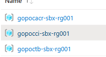
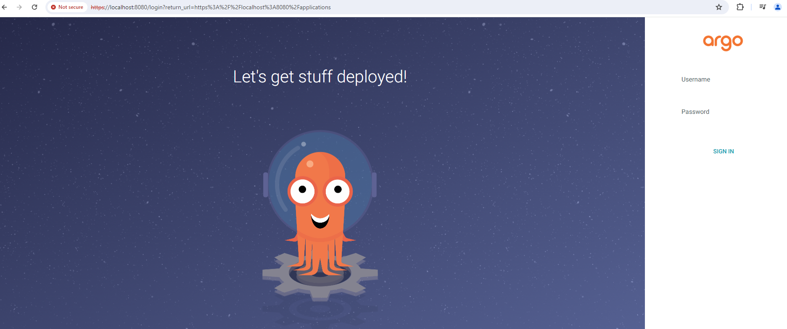
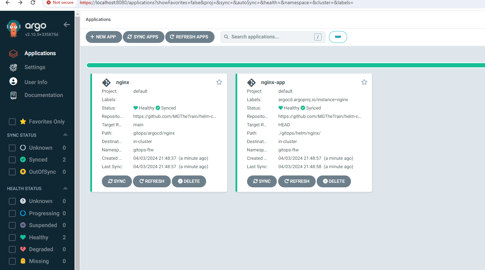
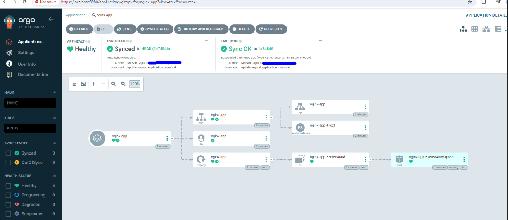

# gitops-poc

## Table of Contents

+ [Summary](#summary)
+ [Features](#features)
+ [Getting started](#getting-started)

## Summary

Repository deploying an AKS cluster on demand, installing ArgoCD or Flux on those clusters enabling GitOps for custom helm charts

## Features

- [x] AKS deployment trough terraform cli tool and HCL files. 
- [x] ArgoCD or Flux installations on deployed k8s cluster
- [x] CD wofklow for on demand deployments of an Azure Storage Account Container (**For storing terraform state files**)
- [x] CD wofklow for on demand deployments of k8s clusters (Options: AKS) and installation of GitOps tools (Options: ArgoCD or Flux) or destruction of k8s clusters trough Github `workflow_dispatch` trigger (**Requires an Azure Storage Account Container**)
- [x] Sample C# ASP.NET Core HelloWorld service along with a CI workflow for building and pushing the container image, including the build artifacts of the service, to an Azure Container Registry (ACR)
- [x] Nginx helm charts and kustomization's required for GitOps

## Getting started

Github workflows will be utilized in [this](./.github/workflows/). Required secrets need to be set therefore for this Github repository. Once the workflows described in the **Preconditions** and **Deploy an AKS cluster and install the ArgoCD or FluxCD helm charts** sections have been successfully executed, all resource groups listed should be visible in the Azure Portal UI:



### Preconditions

0. **Optional:** Create an ACR trough the [deploy-or-destroy workflow](./.github/workflows/deploy-or-destroy)
1. **Optional:** Build and push a sample service with version tag to the ACR trough the [build-and-push.yml workflow](./.github/workflows/build-and-push.yml). 
2. Deploy an Azure Storage Account Service including container for terraform backends trough the [deploy-or-destroy workflow](./.github/workflows/deploy-or-destroy) considering the `INFRASTRUCTURE_OPERATIONS option storage-account-backend-deploy`

### Deploy an AKS cluster and install the ArgoCD or FluxCD helm charts

0. Deploy an AKS trough the [deploy-or-destroy workflow](https://github.com/MGTheTrain/gitops-poc/actions/workflows/deploy-or-destroy) considering the `INFRASTRUCTURE_OPERATIONS option k8s-service-deploy`. **NOTE:** `ACR_*` secrets for this workflow need to be resolved by copying over values of the deployed ACR from an Azure Portal UI.
1. **Optional:** Install only helm charts to an existing kubernetes cluster trough [deploy-or-destroy workflow](https://github.com/MGTheTrain/gitops-poc/actions/workflows/deploy-or-destroy) considering the `INFRASTRUCTURE_OPERATIONS option helm-charts-install`

**NOTE:** Set all the required Github secrets for aboves workflows

#### Port forwarding

In order to port forward and check helm chart pods, run following commands:

```sh
kubectl get pods -A
kubectl port-forward -n <namespace>  <pod-name> <local-port>:<server-port>
```

When checking for example the ArgoCD Web UI, you would run:

```sh
kubectl port-forward -n gitops <argocd-server-pod> 8080:8080
```

and visit in a browser of choice `localhost:8080`. You would need to authenticate with admin credentials.



The default username is `admin`. The default password can be obtained trough: `kubectl -n argocd get secret argocd-initial-admin-secret -n gitops -o jsonpath="{.data.password}" | base64 -d`.

### Showcase GitOps

#### Registering ArgoCD applications or deploying FluxCD Kustomizations

##### Trough CLI tools for registering and syncing ArgoCD applications:

```sh
# Port forward in terminal process A
kubectl port-forward -n gitops <argocd-server-pod> 8080:8080

# In terminal process B - Login
argocd login localhost:8080
# Prompted to provide username and password

# In terminal process B - Register Application
argocd app create nginx \
  --repo <GIT_REPO_URL> \
  --path <PATH_IN_REPO> \
  --dest-server <K8S_CLUSTER_URL> \
  --dest-namespace <NAMESPACE> \
  --revision <TARGET_REVISION> \
  --server <ARGOCD_SERVER>

# e.g. for nginx chart
argocd app create nginx \
  --repo https://github.com/MGTheTrain/gitops-poc.git \
  --path gitops/argocd/nginx \ 
  --dest-server https://kubernetes.default.svc \
  --dest-namespace gitops \
  --revision main \
  --server localhost:8080

# In terminal process B - Sync Application
argocd app sync nginx
# In terminal process B - Monitor Application Status
argocd app get nginx

# Check if the nginx service could be created properly 
kubectl get svc -n gitops
# Additionally, verify the public IP address of the nginx-controller and access the default nginx view using a preferred web browser by navigating to http://<public IP>.
```
The Argo CD application that has been registered and synchronized should resemble the following:





The same applies for the internal `sample-service` helm chart

##### Trough CLI tools for deploying FluxCD Kustomizations:

(Preferred) Utilizing `kubectl`:

```sh
# Precondition - `git clone git@github.com:MGTheTrain/gitops-poc.git`
cd <some path>/helm-chart-samples/gitops/fluxcd/nginx/overlays/dev
kubectl apply -f kustomization.yaml

# See the source status
kubectl get gitrepositories -n gitops
# IMPORTANT - See the reconciliation status
kubectl get kustomizations -n gitops
# Describe customization
kubectl describe kustomization nginx -n gitops

# Check if the nginx service could be created properly 
kubectl get svc -n gitops
# Additionally, verify the public IP address of the nginx-controller and access the default nginx view using a preferred web browser by navigating to http://<public IP>.
```

(**NOTE:** Need to be further checked) Utilizing `flux` cli tool:

```sh
flux create kustomization nginx \
--source=<GIT_REPO_URL> \
--path="<PATH_IN_REPO>" \
--prune=true \
--interval=5m \
--wait=true \
--health-check-timeout=3m \
--namespace=<NAMESPACE>

flux create kustomization nginx \
--source=https://github.com/MGTheTrain/gitops-poc.git/nginx \
--path="./gitops/fluxcd/nginx/overlays/dev" \
--prune=true \
--interval=5m \
--wait=true \
--health-check-timeout=3m \
--namespace=gitops

# Check if the nginx service could be created properly 
kubectl get svc -n gitops
# Additionally, verify the public IP address of the nginx-controller and access the default nginx view using a preferred web browser by navigating to http://<public IP>.
```

Registered [ArgoCD applications or FluxCD Kustomization manifests](./gitops/) will treat Helm charts and kustomization manifests for the `HEAD of this repos main branch` as the sole source of truth within the Kubernetes cluster. Any changes made will be synchronized with the Kubernetes cluster trough the **Sync Controllers** accordingly.

### Destroy the AKS cluster or uninstall helm charts

0. **Optional:** Uninstall only helm charts of an existing kubernetes cluster trough [deploy-or-destroy workflow](https://github.com/MGTheTrain/gitops-poc/actions/workflows/deploy-or-destroy) considering the `INFRASTRUCTURE_OPERATIONS option helm-charts-uninstall`
1. Destroy an AKS trough the [deploy-or-destroy workflow](https://github.com/MGTheTrain/gitops-poc/actions/workflows/deploy-or-destroy) considering the `INFRASTRUCTURE_OPERATIONS option k8s-service-destroy`
