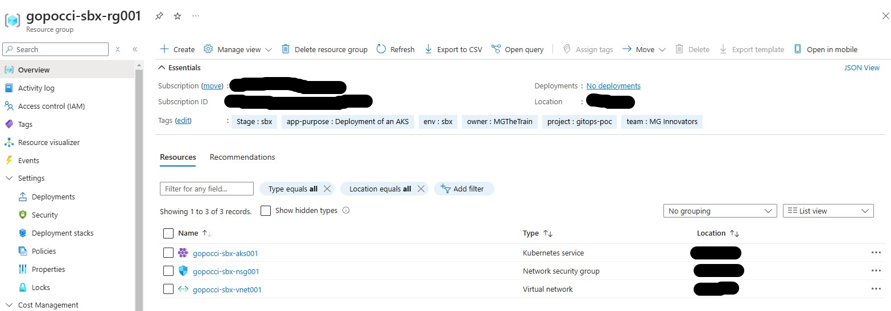
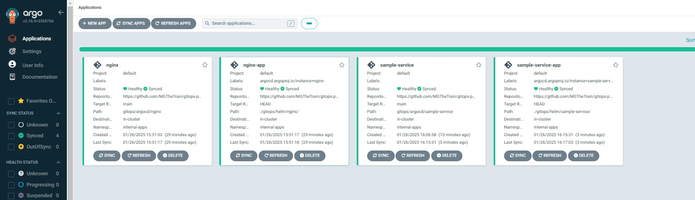
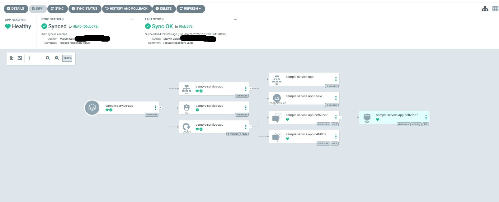
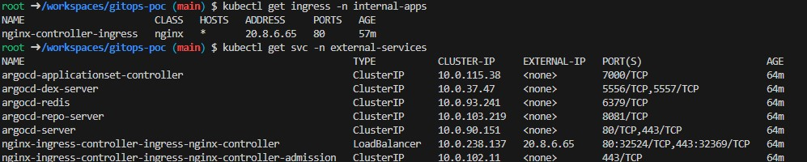
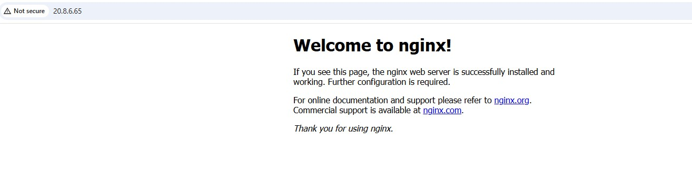
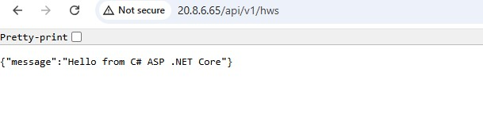

# gitops-poc

## Table of Contents

+ [Summary](#summary)
+ [Features](#features)
+ [Getting started](#getting-started)

## Summary

Repository deploying an AKS cluster on demand, installing ArgoCD or Flux on those clusters enabling GitOps for custom helm charts

## Features

- [x] AKS deployment trough terraform cli tool and HCL files. 
- [x] ArgoCD or Flux installations on deployed k8s cluster
- [x] CD wofklow for on demand deployments of an Azure Storage Account Container (**For storing terraform state files**)
- [x] CD wofklow for on demand deployments of k8s clusters (Options: AKS) and installation of GitOps tools (Options: ArgoCD or Flux) or destruction of k8s clusters trough Github `workflow_dispatch` trigger (**Requires an Azure Storage Account Container**)
- [x] Sample C# ASP.NET Core HelloWorld service along with a CI workflow for building and pushing the container image, including the build artifacts of the service, to an Azure Container Registry (ACR)
- [x] Nginx and sample-service helm charts and kustomization's required for GitOps

## Getting started

Github workflows will be utilized in [this](./.github/workflows/). Required secrets need to be set therefore for this Github repository. Once the workflows described in the **Preconditions** and **Deploy an AKS cluster and install the ArgoCD or FluxCD helm charts** sections have been successfully executed, all resource groups listed should be visible in the Azure Portal UI:




### Preconditions

0. **Optional:** Create an ACR trough the [deploy-container-registry workflow](https://github.com/MGTheTrain/gitops-poc/actions/workflows/deploy-container-registry.yml)
1. **Optional:** Build and push a sample service with version tag to the ACR trough the [build-and-push-docker.yml workflow](https://github.com/MGTheTrain/gitops-poc/actions/workflows/build-and-push-docker.yml). 
2. Deploy an Azure Storage Account Service including containers persisting terraform state files trough the [deploy-tf-backend workflow](https://github.com/MGTheTrain/gitops-poc/actions/workflows/deploy-tf-backend.yml)

### Deploy an AKS cluster, install ArgoCD or FluxCD helm charts or setup kubernetes resources for applications

0. Deploy an AKS trough the [manage-k8s-cluster workflow](https://github.com/MGTheTrain/gitops-poc/actions/workflows/manage-k8s-cluster). 
1. **Optional:** Install external helm charts into the deployed kubernetes cluster trough [manage-helm-charts workflow](https://github.com/MGTheTrain/gitops-poc/actions/workflows/manage-helm-charts)
2. **Optional:** Deploy kubernetes resources for application (secrets or reverse-proxy ingress) trough [manage-internal-k8s-resources workflow](https://github.com/MGTheTrain/gitops-poc/actions/workflows/manage-internal-k8s-resources)

**NOTE:** Set all the required Github secrets for aboves workflows

#### Port forwarding

In order to port forward and check helm chart pods, run following commands:

```sh
kubectl get pods -A
kubectl port-forward -n <namespace>  <pod-name> <local-port>:<server-port>
```

When checking for example the ArgoCD Web UI, you would run:

```sh
kubectl port-forward -n external-services <argocd-server-pod> 8080:8080
```

and visit in a browser of choice `localhost:8080`. You would need to authenticate with admin credentials.


The default username is `admin`. The default password can be obtained trough: `kubectl -n argocd get secret argocd-initial-admin-secret -n external-services -o jsonpath="{.data.password}" | base64 -d`

### Showcase GitOps

#### ArgoCD applications

In order to register and sync ArogCD applications run:

```sh
# Port forward in terminal process A
kubectl port-forward -n external-services <argocd-server-pod> 8080:8080

# In terminal process B - Login
argocd login localhost:8080
# Prompted to provide username and password

# In terminal process B - Register Application
argocd app create nginx \
  --repo <GIT_REPO_URL> \
  --path <PATH_IN_REPO> \
  --dest-server <K8S_CLUSTER_URL> \
  --dest-namespace <NAMESPACE> \
  --revision <TARGET_REVISION> \
  --server <ARGOCD_SERVER>

# e.g. for nginx chart
argocd app create nginx \
  --repo https://github.com/MGTheTrain/gitops-poc.git \
  --path gitops/argocd/nginx \ 
  --dest-server https://kubernetes.default.svc \
  --dest-namespace internal-apps \
  --revision main \
  --server localhost:8080

# In terminal process B - Sync Application
argocd app sync nginx
# In terminal process B - Monitor Application Status
argocd app get nginx

# e.g. sample service
argocd app create sample-service \
  --repo https://github.com/MGTheTrain/gitops-poc.git \
  --path gitops/argocd/sample-service \ 
  --dest-server https://kubernetes.default.svc \
  --dest-namespace internal-apps \
  --revision main \
  --server localhost:8080

# In terminal process B - Sync Application
argocd app sync sample-service
# In terminal process B - Monitor Application Status
argocd app get sample-service

# If an error appears in the ArgoCD Web UI while pulling Docker images for the sample service try manually deleting and then recreating the Docker secret
kubectl delete secret acr-secret -n internal-apps
kubectl create secret docker-registry acr-secret --docker-server=<> --docker-username=<> --docker-password=<> -n internal-apps

# Some relatable links to the issue:
# - https://registry.terraform.io/providers/hashicorp/kubernetes/latest/docs/resources/secret#example-usage-docker-config
# - https://stackoverflow.com/questions/41203970/pull-image-azure-container-registry-kubernetes

# Check if the internal services could be created properly 
kubectl get svc -n internal-apps
# Additionally, verify the public IP address of the nginx-controller and access the default nginx view using a preferred web browser by navigating to http://<public IP>.
```
The Argo CD applications that has been registered and synchronized should resemble the following:





To obtain the external IP address of the Nginx controller's load balancer, run:



Checkout `nginx-app` route in a preferred browser



and `sample-service-app` route in a preferred browser


---

##### FluxCD Kustomizations

In order to deploy FluxCD Kustomizations run:

```sh
cd gitops/fluxcd/nginx/overlays/dev
kubectl apply -f kustomization.yaml

# See the source status
kubectl get gitrepositories -n internal-apps
# IMPORTANT - See the reconciliation status
kubectl get kustomizations -n internal-apps
# Describe customization
kubectl describe kustomization nginx -n internal-apps

# Check if the nginx service could be created properly 
kubectl get svc -n internal-apps
# Additionally, verify the public IP address of the nginx-controller and access the default nginx view using a preferred web browser by navigating to http://<public IP>.
```

or utilize `flux` cli tool (**NOTE:** Need to be further checked):

```sh
flux create kustomization nginx \
--source=<GIT_REPO_URL> \
--path="<PATH_IN_REPO>" \
--prune=true \
--interval=5m \
--wait=true \
--health-check-timeout=3m \
--namespace=<NAMESPACE>

flux create kustomization nginx \
--source=https://github.com/MGTheTrain/gitops-poc.git/nginx \
--path="./gitops/fluxcd/nginx/overlays/dev" \
--prune=true \
--interval=5m \
--wait=true \
--health-check-timeout=3m \
--namespace=gitops

# Check if the nginx service could be created properly 
kubectl get svc -n internal-apps
# Additionally, verify the public IP address of the nginx-controller and access the default nginx view using a preferred web browser by navigating to http://<public IP>.
```

Registered [ArgoCD applications or FluxCD Kustomizations](./gitops/) of the `HEAD of this repo's main branch` will be treated as the sole source of truth within the Kubernetes cluster, with the reconciliation loop ensuring that the desired state matches the cluster's actual state through Kubernetes controllers.

### Destroy the AKS cluster, uninstall helm charts or remove kubernetes resources for applications

0. **Optional:** Uninstall external helm charts of the deployed kubernetes cluster trough [manage-helm-charts workflow](https://github.com/MGTheTrain/gitops-poc/actions/workflows/manage-helm-charts)
1. **Optional:** Destroy kubernetes resources for application (secrets or reverse-proxy ingress) trough [manage-internal-k8s-resources workflow](https://github.com/MGTheTrain/gitops-poc/actions/workflows/manage-internal-k8s-resources)
2. Destroy an AKS trough the [manage-k8s-cluster workflow](https://github.com/MGTheTrain/gitops-poc/actions/workflows/manage-k8s-cluster)
